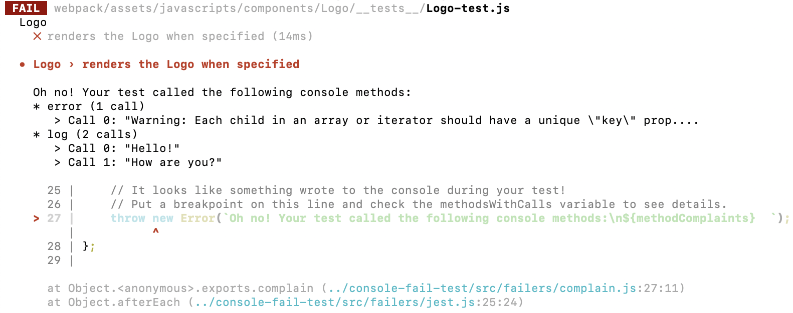

# console-fail-test

[](https://circleci.com/gh/Codecademy/console-fail-test)
[](https://greenkeeper.io/)


Gently fails test runs if the console was used during them.

## Usage

`console-fail-test` is meant to support any _(test framework)_ & _(spy library)_ combination.
It will auto-detect your combination if possible and use the most appropriate environment hooks and function spies it can find.

In general, you can use the Node API to request specific test frameworks and spy libraries:

```js
require("console-fail-test").cft({
    testFramework: "jest",
    spyLibrary: "jasmine",
});
```

### Test Frameworks

Test frameworks that are ✨ auto-detectable can be supported by just running `console-fail-test/setup.js` before tests.
For others, use the Node API with their API request:

```js
require("console-fail-test").cft({
    testFramework: require("ava"),
});
```

<table>
  <thead>
    <tr>
      <td>Framework</td>
      <td>Support?</td>
      <td>API Request</td>
      <td>Documentation</td>
    </tr>
  </thead>
  <tbody>
    <tr>
      <td>Ava</td>
      <td>
        <span aria-label="supported" role="img">✅️</span>
      </td>
      <td>
        <code>require("ava")</code>
      </td>
      <td>
        <a href="./docs/Ava.md">
          <code>Ava.md</code>
        </a>
      </td>
    </tr>
    <tr>
      <td>Mocha</td>
      <td>
        <span aria-label="supported" role="img">✅️</span>
      </td>
      <td>
        <code>"mocha"</code>
      </td>
      <td>
        <a href="./docs/Mocha.md">
          <code>Mocha.md</code>
        </a>
      </td>
    </tr>
    <tr>
      <td>Jasmine</td>
      <td>
        <span aria-label="supported" role="img">✅️</span>
      </td>
      <td>
        <code>"jasmine"</code>
      </td>
      <td>
        <a href="./docs/Jasmine.md">
          <code>Jasmine.md</code>
        </a>
      </td>
    </tr>
    <tr>
      <td>Jest</td>
      <td>
        <span aria-label="supported" role="img">✅️</span>
      </td>
      <td>
        <code>"jest"</code>
      </td>
      <td>
        <a href="./docs/Jest.md">
          <code>Jest.md</code>
        </a>
      </td>
    </tr>
    <tr>
      <td>lab</td>
      <td>
        <span aria-label="not yet supported" role="img">⚙️</span>
      </td>
      <td />
      <td>
        <a href="https://github.com/RyzacInc/console-fail-test/issues/20">
          <code>/issues/20</code>
        </a>
      </td>
    </tr>
    <tr>
      <td>node-tap</td>
      <td>
        <span aria-label="not yet supported" role="img">⚙️</span>
      </td>
      <td />
      <td>
        <a href="https://github.com/RyzacInc/console-fail-test/issues/18">
          <code>/issues/18</code>
        </a>
      </td>
    </tr>
    <tr>
      <td>QUnit</td>
      <td>
        <span aria-label="not yet supported" role="img">⚙️</span>
      </td>
      <td />
      <td>
        <a href="https://github.com/RyzacInc/console-fail-test/issues/19">
          <code>/issues/19</code>
        </a>
      </td>
    </tr>
    <tr>
      <td>tape</td>
      <td>
        <span aria-label="not yet supported" role="img">⚙️</span>
      </td>
      <td />
      <td>
        <a href="https://github.com/RyzacInc/console-fail-test/issues/17">
          <code>/issues/17</code>
        </a>
      </td>
    </tr>
    <tr>
      <td>TestCafe</td>
      <td>
        <span aria-label="not yet supported" role="img">⚙️</span>
      </td>
      <td />
      <td>
        <a href="https://github.com/RyzacInc/console-fail-test/issues/15">
          <code>/issues/15</code>
        </a>
      </td>
    </tr>
  </tbody>
</table>

> See [open test framework support issues](https://github.com/RyzacInc/console-fail-test/issues?q=is%3Aissue+is%3Aopen+label%3A%22test+framework+support%22) for progress!

### Spy Libraries

If a supported spy library isn't detected, an internal fallback will be used to spy on `console` methods.

You can request a specific test library using the Node API with its API request:

```js
require("console-fail-test").cft({
    spyLibrary: "sinon",
});
```

<table>
  <thead>
    <tr>
      <td>Library</td>
      <td>Support?</td>
      <td>API Request</td>
      <td>Spy</td>
      <td>Documentation</td>
    </tr>
  </thead>
  <tbody>
    <tr>
      <td>Jasmine</td>
      <td>
        <span aria-label="supported" role="img">✅️</span>
      </td>
      <td>
        <code>"jasmine"</code>
      </td>
      <td>
        <a href="https://jasmine.github.io/2.0/introduction.html#section-Spies">
          <code>jasmine.createSpy()</code>
        </a>
      </td>
      <td>
        <a href="./docs/Jasmine.md">
          <code>Jasmine.md</code>
        </a>
      </td>
    </tr>
    <tr>
      <td>Jest</td>
      <td>
        <span aria-label="supported" role="img">✅️</span>
      </td>
      <td>
        <code>"jest"</code>
      </td>
      <td>
        <a href="https://jestjs.io/docs/en/mock-functions.html">
          <code>jest.fn()</code>
        </a>
      </td>
      <td>
        <a href="./docs/Jest.md">
          <code>Jest.md</code>
        </a>
      </td>
    </tr>
    <tr>
      <td>Sinon</td>
      <td>
        <span aria-label="supported" role="img">✅️</span>
      </td>
      <td>
        <code>require("sinon")</code>
      </td>
      <td>
        <a href="https://sinonjs.org/releases/latest/spies">
          <code>sinon.spy()</code>
        </a>
      </td>
      <td>
        <a href="./docs/Sinon.md">
          <code>Sinon.md</code>
        </a>
      </td>
    </tr>
  </tbody>
</table>

## Why?

Logging to the console during tests can be a sign of

-   🚫 warnings from third-party libraries such as React for improper usage
-   🤕 temporary code that shouldn't be checked into your project
-   📢 unnecessary spam in your tests window

This little library throws an error after each test if a console method was called during it.
It's got some nifty features:

-   📊 Summary of which methods are called with calling arguments
-   🛫 Failures are thrown _after_ tests finish, so your tests will fail normally if they should

Look how fancy the terminal output is with Jest!


